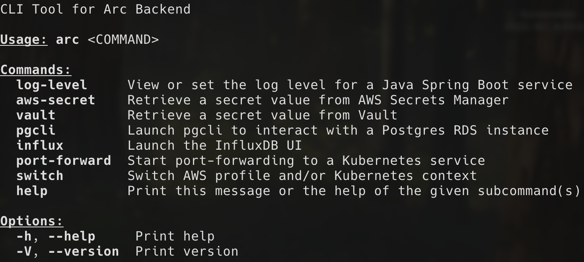

# arc-cli
A CLI Tool for Arc Backend

## Overview
The main benefits of the Arc CLI are:
- It provides a single, unified CLI for tasks that normally require multiple tools and custom shell functions.
- Command dependencies are automatically handled. For instance:
  - If a command needs port-forwarding (i.e. log-level), a session will be automatically started/stopped
  - If a command requires a secret, it will be automatically fetched
  - If a command interacts with AWS and you don't have an active AWS profile, you'll be prompted to select one
- If command args aren't explicitly provided, the user is prompted to interactively select from a menu.\
  (So you don't have to remember every profile name, k8s context, service port, etc.)
- Selection menus are context-aware, meaning values are filtered based on previously specified inputs.
- Terminal isolation is enforced for Kubernetes contexts, meaning that multiple terminal sessions, with different contexts, can be open simultaneously.
- It's built with Rust, ensuring high performance and reliability.



## Installation

### Option 1: From Source
1. Install Rust (from https://www.rust-lang.org/tools/install)
   ```bash
   $ curl --proto '=https' --tlsv1.2 https://sh.rustup.rs -sSf | sh
   ```
2. Download the source code:
   ```bash
   $ git clone git@github.com:bobchevalieragility/arc-cli.git
   ```
3. From the root of the project, build and install the binary:   
   ```bash
   $ cargo install --path .
   ```
4. Create `~/.arc-cli/` and copy the wrapper script into that directory:  
   ```bash
   $ mkdir ~/.arc-cli
   $ cp scripts/arc.sh ~/.arc-cli/arc.sh
   ```
5. Source the wrapper script from your shell config file (.zshrc, .bashrc, etc.):
   ```bash
   $ echo 'source ~/.arc-cli/arc.sh' >> ~/.zshrc
   ```
### Option 2: Pre-compiled Binaries

## Development

### Commit Message Convention

This project uses [Conventional Commits](https://www.conventionalcommits.org/) to automatically generate changelogs and determine version bumps. When you commit changes, use the following format:

```
<type>(<scope>): <description>

[optional body]

[optional footer]
```

#### Commit Types and Changelog Groups

The following table shows which commit prefixes appear in the changelog and how they affect versioning:

| Commit Prefix | Changelog Group        | Semantic Version Impact   | Example Commit Message                    |
|---------------|------------------------|---------------------------|-------------------------------------------|
| `feat`        | ⛰️ Features            | **Minor** (0.1.0 → 0.2.0) | `feat: add vault secret retrieval`        |
| `fix`         | 🐛 Bug Fixes           | **Patch** (0.1.0 → 0.1.1) | `fix: resolve port forwarding timeout`    |
| `perf`        | ⚡ Performance          | **Patch** (0.1.0 → 0.1.1) | `perf: optimize kube API calls`           |
| `refactor`    | 🚜 Refactor            | No version bump           | `refactor: simplify task execution logic` |
| `doc`         | 📚 Documentation       | No version bump           | `doc: update installation instructions`   |
| `style`       | 🎨 Styling             | No version bump           | `style: format code with rustfmt`         |
| `test`        | 🧪 Testing             | No version bump           | `test: add integration tests for RDS`     |
| `chore`       | ⚙️ Miscellaneous Tasks | No version bump           | `chore: update dependencies`              |
| `ci`          | ⚙️ Miscellaneous Tasks | No version bump           | `ci: fix release workflow`                |
| `revert`      | ◀️ Revert              | No version bump           | `revert: undo previous commit`            |

#### Breaking Changes

To trigger a **Major** version bump (0.1.0 → 1.0.0), add `BREAKING CHANGE:` in the commit body or footer:

```
feat: redesign CLI arguments

BREAKING CHANGE: All command arguments have been restructured
```

Or use an exclamation mark after the type/scope:

```
feat!: redesign CLI arguments
```

#### Commits Excluded from Changelog

The following commit types are automatically excluded from the changelog:

- `chore(release):` - Release commits
- `chore(deps)` - Dependency updates  
- `chore(pr)` / `chore(pull)` - PR maintenance
- `refactor(clippy)` - Clippy suggestions

#### Scopes (Optional)

You can add a scope to provide additional context:

```
feat(vault): add secret caching
fix(kube): handle connection timeout
docs(readme): add contribution guidelines
```

### Release Process

This project uses [release-plz](https://release-plz.iem.at/) to automate releases:

1. **Merge a PR to `main`** - Use conventional commit messages
2. **Automated PR is created** - release-plz analyzes commits and creates a PR with:
   - Updated version in `Cargo.toml`
   - Generated changelog in `CHANGELOG.md`
3. **Review and merge the PR** - Once merged:
   - A Git tag is created with the new version
   - A GitHub Release is created and associated with the new tag
   - Binaries are built for multiple architectures and uploaded to Release

No manual version bumping or changelog editing required!

